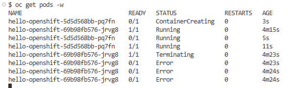
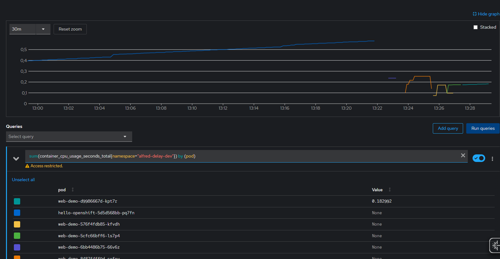

---

````markdown
# TP OpenShift - Déploiement et Monitoring avancé

## Objectif

- Déployer une application avec stratégie Rolling Update
- Ajouter des probes (health checks) pour la haute disponibilité
- Visualiser les métriques et logs
- Simuler un incident et observer le comportement d'auto-réparation
- (Bonus) Tester le canary release et le rollback

---

## 1. Créer un projet dédié

```bash
oc new-project tp-monitoring
````

---

## 2. Déployer une application de test

```bash
oc new-app nginxinc/nginx-unprivileged --name=web-demo
```

---

## 3. Ajouter des probes de santé

### Liveness Probe

```bash
oc set probe deployment/web-demo \
  --liveness --get-url=http://:8080/ --initial-delay-seconds=5
```

### Readiness Probe

```bash
oc set probe deployment/web-demo \
  --readiness --get-url=http://:8080/ --initial-delay-seconds=3
```

---

## 4. Forcer un Rolling Update

```bash
oc set env deployment/web-demo DEMO_VERSION=v2
```

* Surveille l’évolution des pods :

```bash
oc get pods -w
```



---

## 5. Accéder aux métriques et logs

* Depuis la console OpenShift : **Observe > Metrics**
  Exemples de requêtes PromQL :

  ```
  sum(container_cpu_usage_seconds_total{namespace="<nom_votre_projet>"}) by (pod)
  ```


* Voir les logs en CLI :

```bash
oc logs deployment/web-demo
```

---

## 6. Simuler un incident et tester les probes

1. Expose le service HTTP :

   ```bash
   oc expose svc/web-demo
   oc get route
   ```

2. Arrête le process dans le pod (simule une panne) :

   ```bash
   oc get pods
   oc rsh <pod-name>
   kill 1
   ```

3. Observe le redémarrage automatique (liveness probe).

---

## 7. Déploiement canary & rollback

1. Créer une version canary :

   ```bash
   oc new-app nginxinc/nginx-unprivileged --name=hello-canary
   ```

2. Répartir le trafic entre les deux versions :

   ```bash
   oc set route-backends web-demo web-demo=80 hello-canary=20
   oc get route web-demo
   ```

3. Simule une panne sur la version canary et observe le rollback.

---

## 8. Nettoyer le projet après le TP

```bash
oc delete all --all
```

---